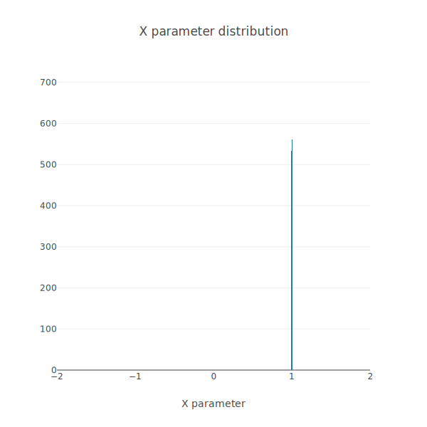

# Simulated annealing and Rosenbrock

In this project, I developed a simulated annealing algorithm in pure Rust. Simulated annealing is a stochastic algorithm used to approximate the global maximum/minimum of a function. In cognitive psychology (my field of research), many of our models' parameters need to be estimated based on human data. Simulated annealing has always been my favorite algorithm because it is both easy to implement and efficient. This is the first time I developed it in Rust though. This project is less about what simulated annealing is than showing how it performs. The interested reader might want to check the corresponding Wikipedia page: https://en.wikipedia.org/wiki/Simulated_annealing

## The test function

I tested the efficiency of simulated annealing to find the global minimum of the Rosenbrock function, which is considered to be a difficult problem often used as a performance test in function minimization algorithms.

Here is the 2-parameter Rosenbrock function:

$$f\left(x,y\right) = \left(a - x\right)^{2.0} + b\left(y - x^{2.0}\right)^{2.0}$$

Plotting the values produced by the Rosenbrock function, with $a = 1.0$ and $b = 100.0$, this is what we have:

As can be seen, the function has many local minima, making it a particularly difficult problem to solve. With the $a$ and $b$ parameters as defined above, the function has its global minimum at $x = 1.0$ and $y = 1.0$. The value of the global minimum is zero.

## Methods

I used simulated annealing to solve the Rosenbrock function. As simulated annealing is a stochastic approach that only approximates the global minimum of a function, the algorithm needs a stopping criterion. The algorithm stopped after 100,000,000 iterations or until $f\left(x,y\right)$ dropped below 0.0001. The initial temperature was set to 0.01. The temperature decreased linearly using the following rule:

$$temperature_n = temperature_{n-1} * \left(1.0 - \left(k+1\right) / n_{max}\right)$$

With $k$ corresponding to the current iteration of the algorithm, and $n_max$ the maximum number of possible iterations (here 100,000,000).

After the algorithm stopped, $f\left(x,y\right)$ was recorded and repeated 50,000 times, leading to a distribution of $f\left(x,y\right)$ and parameter values representing the algorithm's overall performance.

## Results

Here is how simulated annealing performs on that particular problem. The following graphs show the distribution of $x$ and $y$ parameter values over the 50,000 simulations.

 

And this graph shows the distribution of $f\left(x,y\right)$:

 

As can be seen, the algorithm performs very well, approximating the global minimum with a very low error and approaching the $x = 1.0$ and $y = 1.0'$ as the parameter estimates were massively centered around these values.

## Conclusion

Simulated annealing is an excellent algorithm to approximate the global minimum of a function, which I recommend and will mostly continue to use in the future for my research.

